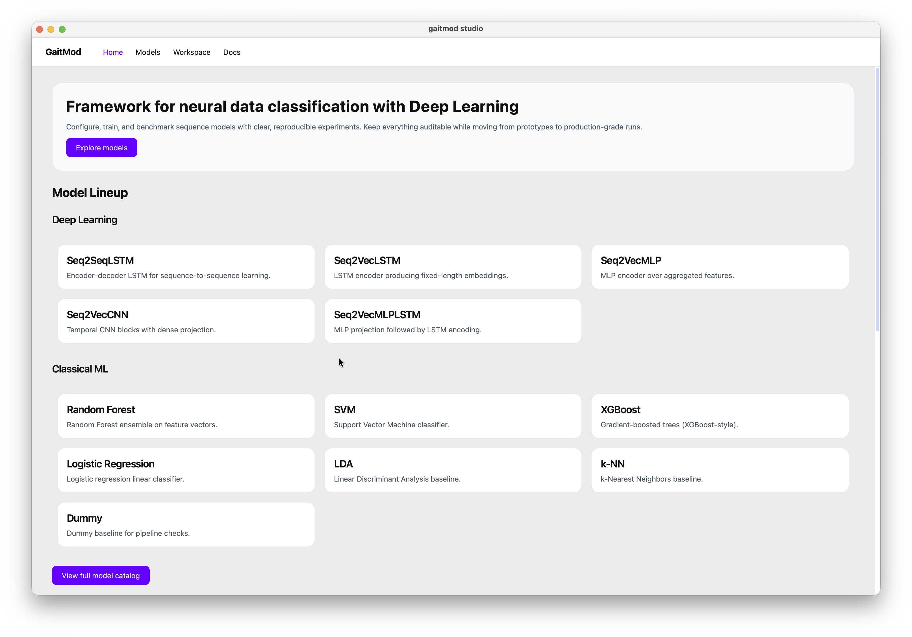
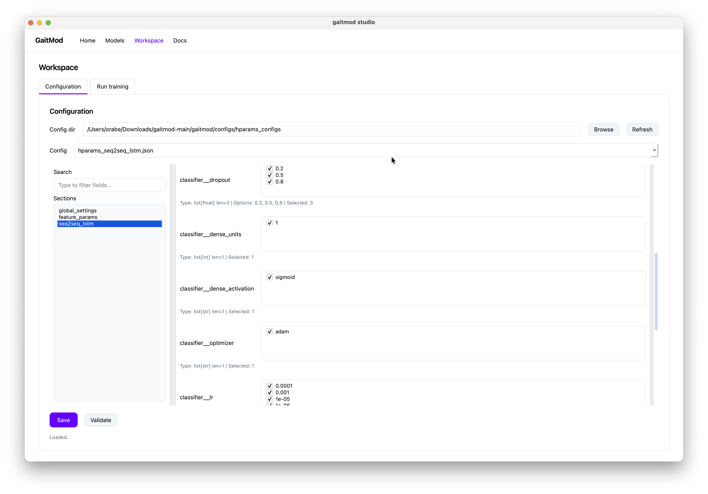

# GaitMod
[](https://pypi.org/project/gaitmod/)
[](https://gaitmod.readthedocs.io/)

**gaitmod** is a Python library for processing, analyzing, and modeling multi-modal neural and movement data, including LFP, EEG, EMG, and IMU signals. It focuses on real-time gait modulation prediction in Parkinson's disease and supports customizable deep learning pipelines.

It provides tools to:

* Preprocess and clean multi-modal data
* Extract and select features from neural and movement signals
* Perform feature selection and statistical testing
* Train and evaluate machine learning models
* Visualize results


*GaitMod desktop application interface*

## Table of Contents

- [GaitMod](#gaitmod)
  - [Table of Contents](#table-of-contents)
  - [Overview](#overview)
  - [Documentation](#documentation)
  - [Installation](#installation)
  - [Usage](#usage)
  - [Project Structure](#project-structure)
  - [Contributing](#contributing)
  - [License](#license)

## Overview

This repository contains code and resources for studying gait modifications using data analysis and machine learning techniques.

## Documentation

Comprehensive documentation is available at [Read the Docs](https://gaitmod.readthedocs.io/).

The latest release of gaitmod can be found on [PyPI](https://pypi.org/project/gaitmod/).

## Installation

Clone the repository:

```bash
git clone https://github.com/yourusername/gaitmod.git
cd gaitmod
```

Install dependencies:

```bash
pip install -r requirements.txt
```

## Usage

Run the main analysis script:

```bash
python main.py
```

Refer to the [documentation on Read the Docs](https://gaitmod.readthedocs.io/) for detailed usage instructions.


*Analysis panel for model selection and hyperparameters tuning*

## Project Structure

```
gaitmod/
├── data/
├── src/
├── results/
├── README.md
└── requirements.txt
```

## Contributing

Contributions are welcome! Please open issues or submit pull requests.

## License

This project is licensed under the MIT License.