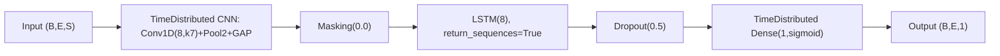
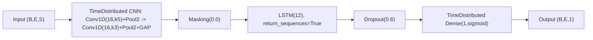

# Seq2SeqCNNLSTM

Source implementation:
- `gaitmod/models/seq2seq_cnn_lstm.py`

Corresponding hyperparameter config:
- `gaitmod/configs/hparams_configs/hparams_seq2seq_cnn_lstm.json`

## Input (3D/4D sequence) and masking

`Seq2SeqCNNLSTM` is a sequence-to-sequence binary classifier for raw time-series epochs.

Supported input formats:

- Single-channel: `X.shape = (B, E, S)`
  - `B`: batch/trials
  - `E`: epochs/timesteps per trial
  - `S`: samples per epoch (e.g., 125)
- Multi-channel: `X.shape = (B, E, S, C)`
  - `C`: channels

Targets:

- `y.shape = (B, E)`

Masking values:

- input mask value from config: `X_mask = 1000000.0`
- target mask value from config: `y_mask = -1`

Mask handling in code:

- Before training/inference, epochs containing `X_mask` are replaced with zeros (`0.0`) in `X_processed`.
- The model applies `Masking(mask_value=0.0)` after TimeDistributed CNN features.
- Loss and metrics ignore `y == y_mask` positions.

## Network topology (from code)

Model is built as a Keras `Sequential` stack:

1. `Input(shape=input_shape)`
2. `TimeDistributed(cnn_extractor)`
   - `cnn_extractor` is built per epoch:
     - Conv block repeated across configured lists:
       - `Conv1D(filters=cnn_filters[i], kernel_size=cnn_kernel_sizes[i], activation=cnn_activations[i], padding='same')`
       - optional `MaxPooling1D(pool_size=cnn_pool_sizes[i])`
     - if `cnn_use_global_pooling=True`: `GlobalAveragePooling1D`
     - else: `Flatten`
3. `Masking(mask_value=0.0)`
4. LSTM block repeated `len(hidden_dims)` times:
   - `LSTM(units=hidden_dims[i], activation=activations[i], recurrent_activation=recurrent_activations[i], return_sequences=True)`
   - `Dropout(rate=dropout)`
5. Sequence output head:
   - `TimeDistributed(Dense(units=dense_units, activation=dense_activation))`

Output is timestep-wise probability, shape `(B, E, 1)`.

## Loss and metric behavior

### Training loss

Model compiles with:

- `weighted_masked_binary_crossentropy_loss`

Loss behavior in code:

- masks out positions where `y_true == y_mask`
- applies optional class weights per timestep (`use_class_weights=True` path)
- normalizes by number of valid (non-masked) timesteps

### Metrics

Masked monitoring metrics (ignore `y_mask`):

- `accuracy`
- `balanced_accuracy`
- `f1_score`
- `precision`
- `recall`
- `roc_auc`
- `pr_auc`

## Training/inference pipeline notes

- `class_weight` is not passed to `model.fit`; weighting is handled inside the custom loss.
- Includes threshold optimization helpers (`optimize_thresholds_with_model`).
- Includes stateful epoch-by-epoch inference path:
  - `build_stateful_model`
  - `convert_to_stateful`
  - `predict_epoch_by_epoch`

## Config-driven architecture search space

From `hparams_seq2seq_cnn_lstm.json` under `Seq2SeqCNNLSTM.architecture_configs`:

1. `cnn_filters=[8], cnn_kernel_sizes=[7], cnn_pool_sizes=[2], hidden_dims=[8]`
2. `cnn_filters=[8,16], cnn_kernel_sizes=[7,5], cnn_pool_sizes=[2,2], hidden_dims=[8]`
3. `cnn_filters=[16], cnn_kernel_sizes=[5], cnn_pool_sizes=[2], hidden_dims=[12]`
4. `cnn_filters=[16,16], cnn_kernel_sizes=[5,3], cnn_pool_sizes=[2,2], hidden_dims=[12]`

Shared architecture settings:

- `cnn_activations=['relu', ...]`
- `cnn_use_global_pooling=true`
- `activations=['tanh']`
- `recurrent_activations=['sigmoid']`
- `use_class_weights=true`
- `threshold=0.5`

From `Seq2SeqCNNLSTM.other_params`:

- `dropout`: `[0.5, 0.6]`
- `dense_units`: `[1]`
- `dense_activation`: `['sigmoid']`
- `optimizer`: `['adam']`
- `lr`: `[0.001, 0.0005]`
- `batch_size`: `[4, 8]`
- `epochs`: `[120]`
- `patience`: `[15]`

From `Seq2SeqCNNLSTM.feature_params`:

- `scaler__scaler_type`: `['standard']`

## Two concrete configuration cases

Case A is the simpler baseline. Case B is the more complex variant.

### Case A (Simple): 1 Conv + 1 LSTM

Concrete config values:

- `classifier__cnn_filters`: `[8]`
- `classifier__cnn_kernel_sizes`: `[7]`
- `classifier__cnn_activations`: `['relu']`
- `classifier__cnn_pool_sizes`: `[2]`
- `classifier__cnn_use_global_pooling`: `true`
- `classifier__hidden_dims`: `[8]`
- `classifier__activations`: `['tanh']`
- `classifier__recurrent_activations`: `['sigmoid']`
- `classifier__dropout`: `0.5`
- `classifier__dense_units`: `1`
- `classifier__dense_activation`: `'sigmoid'`
- `classifier__optimizer`: `'adam'`
- `classifier__lr`: `0.001`
- `classifier__batch_size`: `4`
- `classifier__epochs`: `120`
- `classifier__threshold`: `0.5`

Architecture diagram:



### Case B (Complex): deeper CNN + larger LSTM

Concrete config values:

- `classifier__cnn_filters`: `[16, 16]`
- `classifier__cnn_kernel_sizes`: `[5, 3]`
- `classifier__cnn_activations`: `['relu', 'relu']`
- `classifier__cnn_pool_sizes`: `[2, 2]`
- `classifier__cnn_use_global_pooling`: `true`
- `classifier__hidden_dims`: `[12]`
- `classifier__activations`: `['tanh']`
- `classifier__recurrent_activations`: `['sigmoid']`
- `classifier__dropout`: `0.6`
- `classifier__dense_units`: `1`
- `classifier__dense_activation`: `'sigmoid'`
- `classifier__optimizer`: `'adam'`
- `classifier__lr`: `0.0005`
- `classifier__batch_size`: `8`
- `classifier__epochs`: `120`
- `classifier__threshold`: `0.5`

Architecture diagram:



## 3D-style text illustration (draw.io-like)

For sequence tensors in this illustration:

- `w`: epoch index axis (`E`)
- `h`: within-epoch sample axis (`S`)
- `d`: feature/channel depth (`C` or extracted feature depth)

```txt
Case A (Simple): 1 Conv + 1 LSTM

                       [d = channel/feature depth]
                                  ^
                                  |
        [h = within-epoch samples]| 

        +-----------------------------------+
       /                                   /|
      /   Input raw epochs                 / |
     +-----------------------------------+  |
     | out: (B, E, S)                    |  |
     | geom: w=E, h=S, d=1               |  |
     | masked epochs have X_mask values  |  +
     |                                   | /
     +-----------------------------------+/
        <-------- [w = epoch sequence (E)] -------->
                     |
                     v
        +-----------------------------------+
       /                                   /|
      /   TimeDistributed CNN              / |
     +-----------------------------------+  |
     | per-epoch: Conv1D(8,k7)+Pool2+GAP |  |
     | in:  (B,E,S)                       |  |
     | out: (B,E,8)                       |  +
     | masked epochs -> near-zero feature | /
     +-----------------------------------+/
                     |
                     v
        +-----------------------------------+
       /                                   /|
      /   Masking(0.0) + LSTM(8)+Dropout  / |
     +-----------------------------------+  |
     | in:  (B,E,8)                       |  |
     | out: (B,E,8)                       |  +
     | return_sequences=True              | /
     +-----------------------------------+/
                     |
                     v
        +-----------------------------------+
       /                                   /|
      /   TimeDistributed Dense(1,sigmoid) / |
     +-----------------------------------+  |
     | in:  (B,E,8)                       |  |
     | out: (B,E,1)                       |  +
     | per-epoch probability              | /
     +-----------------------------------+/
                     |
                     v
          Sequence probabilities per epoch


Case B (Complex): deeper CNN + larger LSTM

                       [d = channel/feature depth]
                                  ^
                                  |
        [h = within-epoch samples]| 

        +-----------------------------------+
       /                                   /|
      /   Input raw epochs                 / |
     +-----------------------------------+  |
     | out: (B, E, S)                    |  |
     | geom: w=E, h=S, d=1               |  |
     | masked epochs have X_mask values  |  +
     |                                   | /
     +-----------------------------------+/
        <-------- [w = epoch sequence (E)] -------->
                     |
                     v
        +-----------------------------------+
       /                                   /|
      /   TimeDistributed CNN              / |
     +-----------------------------------+  |
     | per-epoch: Conv16(k5)+Pool2        |  |
     |           Conv16(k3)+Pool2+GAP     |  |
     | out: (B,E,16)                      |  +
     | deeper spatial feature extractor   | /
     +-----------------------------------+/
                     |
                     v
        +-----------------------------------+
       /                                   /|
      /   Masking(0.0) + LSTM(12)+Dropout / |
     +-----------------------------------+  |
     | in:  (B,E,16)                      |  |
     | out: (B,E,12)                      |  +
     | return_sequences=True              | /
     +-----------------------------------+/
                     |
                     v
        +-----------------------------------+
       /                                   /|
      /   TimeDistributed Dense(1,sigmoid) / |
     +-----------------------------------+  |
     | in:  (B,E,12)                      |  |
     | out: (B,E,1)                       |  +
     | per-epoch probability              | /
     +-----------------------------------+/
                     |
                     v
          Sequence probabilities per epoch
```

## Effective architecture summary for current config

`Seq2SeqCNNLSTM` applies per-epoch CNN feature extraction to raw signals, then models cross-epoch temporal dependencies with LSTM, and produces per-epoch binary probabilities via `TimeDistributed(Dense(1,sigmoid))`. Training uses masked + class-weighted BCE and masked metrics, with optional stateful epoch-by-epoch deployment-style inference.
