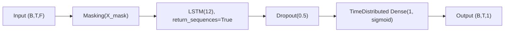
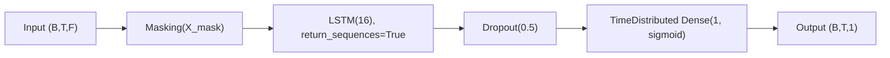

# Seq2SeqLSTM

Source implementation:
- `gaitmod/models/seq2seq_lstm.py`

Corresponding hyperparameter config:
- `gaitmod/configs/hparams_configs/hparams_seq2seq_lstm.json`

## Input (3D sequence) and masking

`Seq2SeqLSTM` is a sequence-to-sequence binary classifier.

- Expected `X` format: `(n_samples, n_timesteps, n_features)`
- Expected `y` format: `(n_samples, n_timesteps)`
- Variable-length handling uses value-based masking:
  - input mask: `mask_values['X_mask']`
  - target mask: `mask_values['y_mask']`

From config (`global_settings.masking`):

- `X_mask = 1000000.0`
- `y_mask = -1`

## Network topology (from code)

Model is built as a Keras `Sequential` stack:

1. `Input(shape=input_shape)`
2. `Masking(mask_value=X_mask)`
3. LSTM block repeated `len(hidden_dims)` times:
   - `LSTM(units=hidden_dims[i], activation=activations[i], recurrent_activation=recurrent_activations[i], return_sequences=True)`
   - `Dropout(rate=dropout)`
4. Sequence output head:
   - `TimeDistributed(Dense(units=dense_units, activation=dense_activation))`

Important details:

- `return_sequences=True` for all LSTM layers (required for seq2seq output).
- Output is timestep-wise probability, shape `(B, T, 1)`.

## Loss and metric behavior

### Training loss

Model compiles with custom loss:

- `weighted_masked_binary_crossentropy_loss`

Loss behavior in code:

- ignores masked timesteps (`y == y_mask`)
- applies optional class weighting per timestep using class weights computed from non-masked labels
- normalizes by number of valid timesteps

### Metrics

The model uses masked monitoring metrics that ignore padded/masked targets:

- `accuracy`
- `balanced_accuracy`
- `f1_score`
- `precision`
- `recall`
- `roc_auc`
- `pr_auc`

## Training/inference pipeline notes

- `class_weight` argument is intentionally not passed to `model.fit` for seq2seq shape compatibility.
- Class balancing is handled inside the custom masked loss.
- Includes optional threshold tuning utilities (`tune_threshold_for_metric`, `tune_all_thresholds`).
- Includes optional stateful epoch-by-epoch prediction path for deployment-style simulation.

## Config-driven architecture search space

From `hparams_seq2seq_lstm.json` under `Seq2SeqLSTM.architecture_configs`:

1. `hidden_dims=[12], activations=['tanh'], recurrent_activations=['sigmoid']`
2. `hidden_dims=[16], activations=['tanh'], recurrent_activations=['sigmoid']`

Shared settings in architecture configs:

- `dropout=0.5`
- `dense_activation='sigmoid'`
- `optimizer='adam'`
- `use_class_weights=true`
- `threshold=0.5`

From `Seq2SeqLSTM.other_params`:

- `lr`: `[0.001, 0.0005]`
- `batch_size`: `[4, 8]`
- `epochs`: `[120]`
- `patience`: `[15]`

From `Seq2SeqLSTM.feature_params`:

- `scaler__scaler_type`: `['standard']`

## Two concrete configuration cases

Case A is the simpler baseline. Case B is the more complex variant.

### Case A (Simple): smaller hidden state

Concrete config values:

- `classifier__hidden_dims`: `[12]`
- `classifier__activations`: `['tanh']`
- `classifier__recurrent_activations`: `['sigmoid']`
- `classifier__dropout`: `0.5`
- `classifier__dense_activation`: `'sigmoid'`
- `classifier__optimizer`: `'adam'`
- `classifier__use_class_weights`: `true`
- `classifier__threshold`: `0.5`
- `classifier__lr`: `0.001`
- `classifier__batch_size`: `4`
- `classifier__epochs`: `120`
- `classifier__patience`: `15`

Architecture diagram:



### Case B (Complex): larger hidden state

Concrete config values:

- `classifier__hidden_dims`: `[16]`
- `classifier__activations`: `['tanh']`
- `classifier__recurrent_activations`: `['sigmoid']`
- `classifier__dropout`: `0.5`
- `classifier__dense_activation`: `'sigmoid'`
- `classifier__optimizer`: `'adam'`
- `classifier__use_class_weights`: `true`
- `classifier__threshold`: `0.5`
- `classifier__lr`: `0.0005`
- `classifier__batch_size`: `8`
- `classifier__epochs`: `120`
- `classifier__patience`: `15`

Architecture diagram:



## 3D-style text illustration (draw.io-like)

For sequence tensors in this illustration:

- `w`: temporal length (`T`)
- `h`: feature axis (`F`)
- `d`: hidden/output depth (`H`)

```txt
Case A (Simple): Seq2Seq LSTM with H=12

                       [d = hidden/output depth (H)]
                                  ^
                                  |
        [h = feature axis (F)]    |

        +-----------------------------------+
       /                                   /|
      /   Input Sequence                   / |
     +-----------------------------------+  |
     | out: (B, T, F)                    |  |
     | geom: w=T, h=F, d=1               |  |
     | includes padded timesteps         |  +
     |                                   | /
     +-----------------------------------+/
        <-------- [w = temporal length (T)] -------->
                     |
                     v
        +-----------------------------------+
       /                                   /|
      /   Masking(X_mask)                  / |
     +-----------------------------------+  |
     | in:  (B, T, F)                    |  |
     | out: (B, T, F)                    |  +
     | masked timesteps ignored downstream| /
     +-----------------------------------+/
                     |
                     v
        +-----------------------------------+
       /                                   /|
      /   LSTM(12) + Dropout(0.5)         / |
     +-----------------------------------+  |
     | in:  (B, T, F)                    |  |
     | out: (B, T, 12)                   |  +
     | return_sequences=True             | /
     +-----------------------------------+/
                     |
                     v
        +-----------------------------------+
       /                                   /|
      /   TimeDistributed Dense(1,sigmoid) / |
     +-----------------------------------+  |
     | in:  (B, T, 12)                   |  |
     | out: (B, T, 1)                    |  +
     | timestep-wise probability         | /
     +-----------------------------------+/
                     |
                     v
          Sequence probabilities per timestep


Case B (Complex): Seq2Seq LSTM with H=16

                       [d = hidden/output depth (H)]
                                  ^
                                  |
        [h = feature axis (F)]    |

        +-----------------------------------+
       /                                   /|
      /   Input Sequence                   / |
     +-----------------------------------+  |
     | out: (B, T, F)                    |  |
     | geom: w=T, h=F, d=1               |  |
     | includes padded timesteps         |  +
     |                                   | /
     +-----------------------------------+/
        <-------- [w = temporal length (T)] -------->
                     |
                     v
        +-----------------------------------+
       /                                   /|
      /   Masking(X_mask)                  / |
     +-----------------------------------+  |
     | in:  (B, T, F)                    |  |
     | out: (B, T, F)                    |  +
     | masked timesteps ignored downstream| /
     +-----------------------------------+/
                     |
                     v
        +-----------------------------------+
       /                                   /|
      /   LSTM(16) + Dropout(0.5)         / |
     +-----------------------------------+  |
     | in:  (B, T, F)                    |  |
     | out: (B, T, 16)                   |  +
     | return_sequences=True             | /
     +-----------------------------------+/
                     |
                     v
        +-----------------------------------+
       /                                   /|
      /   TimeDistributed Dense(1,sigmoid) / |
     +-----------------------------------+  |
     | in:  (B, T, 16)                   |  |
     | out: (B, T, 1)                    |  +
     | timestep-wise probability         | /
     +-----------------------------------+/
                     |
                     v
          Sequence probabilities per timestep
```

## Effective architecture summary for current config

The current `Seq2SeqLSTM` experiments evaluate masked sequence models with one LSTM layer (`12` or `16` units), dropout, and a `TimeDistributed` sigmoid output head for per-timestep binary prediction. Training uses a custom masked + class-weighted BCE loss, and threshold tuning can be applied after fitting.
