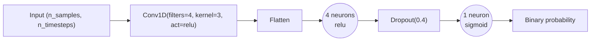
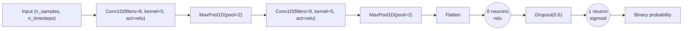

# Seq2VecCNN

Source implementation:
- `gaitmod/models/seq2vec_cnn.py`

Corresponding hyperparameter config:
- `gaitmod/configs/hparams_configs/hparams_seq2vec_cnn.json`

## Input (2D only)

`Seq2VecCNN` is a sequence-to-vector binary classifier used here in single-channel mode.

- Expected external input format: `(n_samples, n_timesteps)`
- This document treats the model interface as 2D input only.

## Network topology (from code)

Model is built as a Keras `Sequential` stack:

1. `Input(shape=input_shape)`
2. `Conv1D` repeated `conv_layers` times:
   - `Conv1D(filters=conv_filters, kernel_size=kernel_size, padding='valid', activation=conv_activation)`
   - Optional: `MaxPooling1D(pool_size=pool_size)` when `use_pooling=True`
3. `Flatten()`
4. Dense block repeated `dense_layers` times:
   - `Dense(neurons=dense_units, activation=dense_activation)`
   - `Dropout(rate=dropout)`
5. Output layer:
   - `Dense(neurons=output_units, activation=output_activation)`

Output is a single sigmoid unit by default (`output_units=1`, `output_activation='sigmoid'`).

## Compile settings (from code)

- Loss: `binary_crossentropy` (default)
- Optimizer options: `adam`, `RMSprop`, `SGD` (config currently uses `adam`)
- Metrics:
  - `accuracy`
  - `balanced_accuracy`
  - `f1_score`
  - `precision`
  - `recall`
  - `roc_auc`
  - `pr_auc`

## Config-driven architecture search space

From `hparams_seq2vec_cnn.json` under `Seq2VecCNN.architecture_configs`:

1. `conv_filters=4, kernel_size=3, conv_layers=1, conv_activation='relu', dense_units=4, dense_layers=1, dense_activation='relu'`
2. `conv_filters=8, kernel_size=3, conv_layers=1, conv_activation='relu', dense_units=8, dense_layers=1, dense_activation='relu'`
3. `conv_filters=8, kernel_size=5, conv_layers=2, conv_activation='relu', dense_units=8, dense_layers=1, dense_activation='relu'`
4. `conv_filters=16, kernel_size=3, conv_layers=1, conv_activation='relu', dense_units=8, dense_layers=1, dense_activation='relu'`

From `Seq2VecCNN.other_params`:

- `dropout`: `[0.4, 0.6]`
- `use_pooling`: `[false, true]`
- `pool_size`: `[2]`
- `output_units`: `[1]`
- `output_activation`: `['sigmoid']`
- `optimizer`: `['adam']`
- `lr`: `[0.001, 0.0005]`
- `patience`: `[15]`
- `epochs`: `[120]`
- `batch_size`: `[16, 32]`
- `threshold`: `[0.5]`

From `Seq2VecCNN.feature_params`:

- `scaler__scaler_type`: `['standard']`

## Two concrete configuration cases

Case A is the simpler baseline. Case B is the more complex variant.

### Case A (Simple): compact CNN (no pooling)

Concrete config values:

- `classifier__conv_filters`: `4`
- `classifier__kernel_size`: `3`
- `classifier__conv_layers`: `1`
- `classifier__conv_activation`: `'relu'`
- `classifier__use_pooling`: `false`
- `classifier__pool_size`: `2`
- `classifier__dense_units`: `4`
- `classifier__dense_layers`: `1`
- `classifier__dense_activation`: `'relu'`
- `classifier__dropout`: `0.4`
- `classifier__output_units`: `1`
- `classifier__output_activation`: `'sigmoid'`
- `classifier__optimizer`: `'adam'`
- `classifier__lr`: `0.001`
- `classifier__batch_size`: `16`
- `classifier__epochs`: `120`
- `classifier__threshold`: `0.5`

Architecture diagram:



### Case B (Complex): deeper CNN (with pooling)

Concrete config values:

- `classifier__conv_filters`: `8`
- `classifier__kernel_size`: `5`
- `classifier__conv_layers`: `2`
- `classifier__conv_activation`: `'relu'`
- `classifier__use_pooling`: `true`
- `classifier__pool_size`: `2`
- `classifier__dense_units`: `8`
- `classifier__dense_layers`: `1`
- `classifier__dense_activation`: `'relu'`
- `classifier__dropout`: `0.6`
- `classifier__output_units`: `1`
- `classifier__output_activation`: `'sigmoid'`
- `classifier__optimizer`: `'adam'`
- `classifier__lr`: `0.0005`
- `classifier__batch_size`: `32`
- `classifier__epochs`: `120`
- `classifier__threshold`: `0.5`

Architecture diagram:



## Effective architecture summary for current config

The configured experiments now evaluate both non-pooled and pooled 1D CNN variants, followed by flattening, one dense hidden layer with dropout, and a 1-unit sigmoid output head for binary segment-level prediction.

## 3D-style text illustration (draw.io-like)

For these 3D boxes, dimensions refer to model tensor axes (not text-box drawing size):

- `w`: temporal length (`T`)
- `h`: vertical signal axis, fixed to `1` for 1D inputs
- `d`: channel/filter count (`C`)

```txt
Case A (Simple): compact CNN (no pooling)

                       [d = channels/filters (C)]
                                  ^
                                  |
        [h = signal height (1)]   |

        +-----------------------------------+
       /                                   /|
      /   Input                            / |
     +-----------------------------------+  |
     | out: (B, 125, 1)                  |  |
     | geom: w=125, h=1, d=1             |  |
     | source: raw 1D segment            |  +
     |                                   | /
     +-----------------------------------+/
        <-------- [w = temporal length (T)] -------->
                     |
                     v
        +-----------------------------------+
       /                                   /|
      /   Conv1D                           / |
     +-----------------------------------+  |
     | in:  (B, 125, 1)                  |  |
     | in-geom:  w=125, h=1, d=1         |  |
     | out: (B, 123, 4)                  |  +
     | out-geom: w=123, h=1, d=4         | /
     | k=3, f=4, act=relu                | /
     +-----------------------------------+/
                     |
                     v
        +-----------------------------------+
       /                                   /|
      /   Flatten                          / |
     +-----------------------------------+  |
     | in:  (B, 123, 4)                  |  |
     | in-geom:  w=123, h=1, d=4         |  |
     | out: (B, 492)                     |  +
     | out-geom: w=492, h=1, d=1         | /
     | temporal x channels -> vector     | /
     +-----------------------------------+/
                     |
                     v
           Hidden Layer: 4 neurons (relu)
                 (o)  (o)  (o)  (o)
           in:  (B, 492) -> out: (B, 4)
                     |
                     v
              Dropout(rate=0.4)
               active shape: (B, 4)
                     |
                     v
             Output Layer: 1 neuron (sigmoid)
                         (o)
           in:  (B, 4) -> out: (B, 1)

               Binary probability

Case B (Complex): deeper CNN (with pooling)

                       [d = channels/filters (C)]
                                  ^
                                  |
        [h = signal height (1)]   |

        +-----------------------------------+
       /                                   /|
      /   Input                            / |
     +-----------------------------------+  |
     | out: (B, 125, 1)                  |  |
     | geom: w=125, h=1, d=1             |  |
     | source: raw 1D segment            |  +
     |                                   | /
     +-----------------------------------+/
        <-------- [w = temporal length (T)] -------->
                     |
                     v
        +-----------------------------------+
       /                                   /|
      /   Conv1D                           / |
     +-----------------------------------+  |
     | in:  (B, 125, 1)                  |  |
     | in-geom:  w=125, h=1, d=1         |  |
     | out: (B, 121, 8)                  |  +
     | out-geom: w=121, h=1, d=8         | /
     | k=5, f=8, act=relu                | /
     +-----------------------------------+/
                     |
                     v
        +-----------------------------------+
       /                                   /|
      /   MaxPool1D                        / |
     +-----------------------------------+  |
     | in:  (B, 121, 8)                  |  |
     | in-geom:  w=121, h=1, d=8         |  |
     | out: (B, 60, 8)                   |  +
     | out-geom: w=60, h=1, d=8          | /
     | pool=2, stride=2                  | /
     +-----------------------------------+/
                     |
                     v
        +-----------------------------------+
       /                                   /|
      /   Conv1D                           / |
     +-----------------------------------+  |
     | in:  (B, 60, 8)                   |  |
     | in-geom:  w=60, h=1, d=8          |  |
     | out: (B, 56, 8)                   |  +
     | out-geom: w=56, h=1, d=8          | /
     | k=5, f=8, act=relu                | /
     +-----------------------------------+/
                     |
                     v
        +-----------------------------------+
       /                                   /|
      /   MaxPool1D                        / |
     +-----------------------------------+  |
     | in:  (B, 56, 8)                   |  |
     | in-geom:  w=56, h=1, d=8          |  |
     | out: (B, 28, 8)                   |  +
     | out-geom: w=28, h=1, d=8          | /
     | pool=2, stride=2                  | /
     +-----------------------------------+/
                     |
                     v
        +-----------------------------------+
       /                                   /|
      /   Flatten                          / |
     +-----------------------------------+  |
     | in:  (B, 28, 8)                   |  |
     | in-geom:  w=28, h=1, d=8          |  |
     | out: (B, 224)                     |  +
     | out-geom: w=224, h=1, d=1         | /
     | temporal x channels -> vector     | /
     +-----------------------------------+/
                     |
                     v
           Hidden Layer: 8 neurons (relu)
          (o)  (o)  (o)  (o)  (o)  (o)  (o)  (o)
           in:  (B, 224) -> out: (B, 8)
                     |
                     v
              Dropout(rate=0.6)
               active shape: (B, 8)
                     |
                     v
             Output Layer: 1 neuron (sigmoid)
                         (o)
           in:  (B, 8) -> out: (B, 1)

               Binary probability

```
