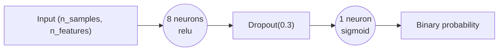
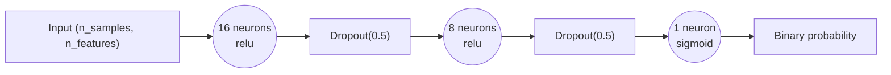

# Seq2VecMLP

Source implementation:
- `gaitmod/models/seq2vec_mlp.py`

Corresponding hyperparameter config:
- `gaitmod/configs/hparams_configs/hparams_seq2vec_mlp.json`

## Input (2D only)

`Seq2VecMLP` is a sequence-to-vector binary classifier for feature vectors.

- Expected external input format: `(n_samples, n_features)`
- This document treats the model interface as 2D input only.

## Network topology (from code)

Model is built as a Keras `Sequential` stack:

1. `Input(shape=input_shape)`
2. For each hidden layer `i` in `hidden_dims`:
   - `Dense(units=hidden_dims[i], activation=activations[i])`
   - `Dropout(rate=dropout)`
3. Output layer:
   - `Dense(units=dense_units, activation=dense_activation)`

Output is a single sigmoid unit by default (`dense_units=1`, `dense_activation='sigmoid'`).

## Compile settings (from code)

- Loss: `binary_crossentropy` (default)
- Optimizer options: `adam`, `RMSprop`, `SGD` (config currently uses `adam`)
- Metrics:
  - `accuracy`
  - `balanced_accuracy`
  - `f1_score`
  - `precision`
  - `recall`
  - `roc_auc`
  - `pr_auc`

## Config-driven architecture search space

From `hparams_seq2vec_mlp.json` under `Seq2VecMLP.architecture_configs`:

1. `hidden_dims=[8], activations=['relu']`
2. `hidden_dims=[16], activations=['relu']`
3. `hidden_dims=[24], activations=['relu']`
4. `hidden_dims=[16, 8], activations=['relu', 'relu']`

From `Seq2VecMLP.other_params`:

- `dropout`: `[0.3, 0.5]`
- `dense_units`: `[1]`
- `dense_activation`: `['sigmoid']`
- `optimizer`: `['adam']`
- `lr`: `[0.001, 0.0005]`
- `batch_size`: `[16, 32]`
- `epochs`: `[120]`
- `patience`: `[15]`
- `threshold`: `[0.5]`

From `Seq2VecMLP.feature_params`:

- `scaler__scaler_type`: `['standard']`

## Two concrete configuration cases

Case A is the simpler baseline. Case B is the more complex variant.

### Case A (Simple): compact 1-layer MLP

Concrete config values:

- `classifier__hidden_dims`: `[8]`
- `classifier__activations`: `['relu']`
- `classifier__dropout`: `0.3`
- `classifier__dense_units`: `1`
- `classifier__dense_activation`: `'sigmoid'`
- `classifier__optimizer`: `'adam'`
- `classifier__lr`: `0.001`
- `classifier__batch_size`: `16`
- `classifier__epochs`: `120`
- `classifier__threshold`: `0.5`

Architecture diagram:



### Case B (Complex): 2-layer MLP

Concrete config values:

- `classifier__hidden_dims`: `[16, 8]`
- `classifier__activations`: `['relu', 'relu']`
- `classifier__dropout`: `0.5`
- `classifier__dense_units`: `1`
- `classifier__dense_activation`: `'sigmoid'`
- `classifier__optimizer`: `'adam'`
- `classifier__lr`: `0.0005`
- `classifier__batch_size`: `32`
- `classifier__epochs`: `120`
- `classifier__threshold`: `0.5`

Architecture diagram:



## Effective architecture summary for current config

The configured experiments use small-to-moderate MLPs (1-2 hidden layers), dropout after each hidden layer, and a 1-unit sigmoid output head for binary segment-level prediction.

## 3D-style text illustration (draw.io-like)

For vectors in this illustration:

- `w`: feature length (`F`)
- `h`: signal height, fixed to `1`
- `d`: channel depth, fixed to `1` after flattening to vectors

```txt
Case A (Simple): compact 1-layer MLP

                       [d = channel depth (1)]
                                  ^
                                  |
        [h = signal height (1)]   |

        +-----------------------------------+
       /                                   /|
      /   Input Vector                     / |
     +-----------------------------------+  |
     | out: (B, F)                       |  |
     | geom: w=F, h=1, d=1               |  |
     | source: epoch-level features      |  +
     |                                   | /
     +-----------------------------------+/
        <-------- [w = feature length (F)] -------->
                     |
                     v
           Hidden Layer: 8 neurons (relu)
                 (o)  (o)  (o)  (o)
                 (o)  (o)  (o)  (o)
           in:  (B, F) -> out: (B, 8)
                     |
                     v
              Dropout(rate=0.3)
               active shape: (B, 8)
                     |
                     v
             Output Layer: 1 neuron (sigmoid)
                         (o)
           in:  (B, 8) -> out: (B, 1)

               Binary probability


Case B (Complex): 2-layer MLP

                       [d = channel depth (1)]
                                  ^
                                  |
        [h = signal height (1)]   |

        +-----------------------------------+
       /                                   /|
      /   Input Vector                     / |
     +-----------------------------------+  |
     | out: (B, F)                       |  |
     | geom: w=F, h=1, d=1               |  |
     | source: epoch-level features      |  +
     |                                   | /
     +-----------------------------------+/
        <-------- [w = feature length (F)] -------->
                     |
                     v
           Hidden Layer 1: 16 neurons (relu)
          (o)  (o)  (o)  (o)  (o)  (o)  (o)  (o)
          (o)  (o)  (o)  (o)  (o)  (o)  (o)  (o)
           in:  (B, F) -> out: (B, 16)
                     |
                     v
              Dropout(rate=0.5)
               active shape: (B, 16)
                     |
                     v
           Hidden Layer 2: 8 neurons (relu)
          (o)  (o)  (o)  (o)  (o)  (o)  (o)  (o)
           in:  (B, 16) -> out: (B, 8)
                     |
                     v
              Dropout(rate=0.5)
               active shape: (B, 8)
                     |
                     v
             Output Layer: 1 neuron (sigmoid)
                         (o)
           in:  (B, 8) -> out: (B, 1)

               Binary probability
```

