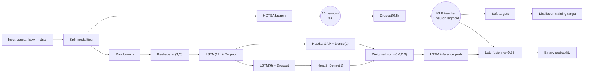
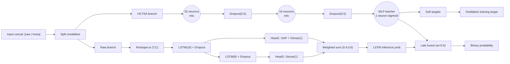

# Seq2VecMLPLSTM

Source implementation:
- `gaitmod/models/seq2vec_mlplstm.py`

Corresponding hyperparameter config:
- `gaitmod/configs/hparams_configs/hparams_seq2vec_mlplstm.json`

## Input and modality integration

`Seq2VecMLPLSTM` is a hybrid sequence-to-vector binary classifier with two modalities:

- Raw LFP segment features (for the LSTM branch)
- HCTSA feature vectors (for the MLP branch)

Expected external input format is a single 2D matrix with concatenated features:

- `X.shape = (n_samples, raw_feature_dim + hctsa_feature_dim)`
- Split rule in code: `X = [raw_features | hctsa_features]`

Internal branch inputs:

- Raw branch (student):
  - `X_raw = X[:, :raw_feature_dim]`
  - reshaped to `X_raw_3d = (B, T, C)` where `T = raw_feature_dim / raw_n_channels`, `C = raw_n_channels`
- HCTSA branch (teacher):
  - `X_hctsa = X[:, raw_feature_dim:]`
  - optional feature selection (`FeatureSelector`) before MLP

## Model types and training pipeline

This class builds and uses three model objects:

1. MLP teacher model (`Sequential`)
   - Input: HCTSA features
   - Output: soft probability `p_mlp`
2. LSTM student training model (`Functional`, multi-output)
   - Outputs: one sigmoid head per LSTM layer + weighted-sum head
   - Used only during distillation training
3. LSTM student inference model (`Functional`, single-output)
   - Output: weighted-sum student probability
   - Used for inference and base prediction

## Network topology (from code)

### Teacher branch (MLP)

1. `Input(shape=(n_hctsa_features_selected,))`
2. For each `mlp_hidden_units[i]`:
   - `Dense(units=mlp_hidden_units[i], activation=mlp_activation[i])`
   - `Dropout(rate=mlp_dropout)`
3. Output:
   - `Dense(1, activation=mlp_dense_activation)`

### Student branch (LSTM with deep supervision)

1. `Input(shape=(T, C))`
2. For each LSTM layer `i` in `lstm_hidden_dims`:
   - `LSTM(units=lstm_hidden_dims[i], activation=lstm_activations[i], recurrent_activation=lstm_recurrent_activations[i], return_sequences=(i < last_layer))`
   - `Dropout(rate=lstm_dropout)`
   - Head `i`:
     - If `return_sequences=True`: `GlobalAveragePooling1D`
     - `Dense(1, activation='sigmoid')`
3. Final output:
   - weighted sum of all heads via `Lambda(tf.add_n(...))`

## Loss functions and objectives

### Teacher loss (MLP)

- MLP is compiled with `mlp_loss` (default `binary_crossentropy`)
- Trained on hard labels `y_hard`

### Student distillation loss (LSTM)

Distillation target is built per sample as:

- `y_distill = concat([y_hard, p_mlp])`, shape `(B, 2)`

Custom distillation loss per output head:

- `hard_loss = BCE(y_hard, y_pred)`
- `soft_loss = BCE(y_soft=p_mlp, y_pred)`
- `distill_loss = (1 - alpha) * hard_loss + alpha * soft_loss`

Training output/loss wiring:

- Train outputs: `[head_1, head_2, ..., head_N, weighted_sum]`
- Loss list: same distill loss for each output
- Loss weights: `lstm_head_weights + [0.0]`

Important detail:

- The weighted-sum output has loss weight `0.0`; optimization is driven by supervised/distilled per-layer heads.
- Metrics are computed with `DistillMetric`, which evaluates against hard labels only (`y_true[:,0:1]`).

## Inference and fusion behavior

`predict_proba` logic:

- Base prediction uses student LSTM inference output.
- If `fusion_weight` is set, late fusion is used:
  - `p = fusion_weight * p_mlp + (1 - fusion_weight) * p_lstm`
- If `fusion_weight` is `None`, output is LSTM-only.

## Compile settings (from code)

- Optimizers:
  - MLP: `adam`, `RMSprop`, `SGD`
  - LSTM: `adam`, `RMSprop`, `SGD`
- Metrics (teacher and distillation wrappers):
  - `accuracy`
  - `balanced_accuracy`
  - `f1_score`
  - `precision`
  - `recall`
  - `roc_auc`
  - `pr_auc`

## Config-driven architecture search space

From `hparams_seq2vec_mlplstm.json`:

- MLP branch architecture:
  - `mlp_hidden_units`: `[16]`, `[32]`, `[32,16]`
  - `mlp_activation`: `relu`
  - `mlp_dense_activation`: `sigmoid`
- LSTM branch architecture:
  - `lstm_hidden_dims`: `[12,6]` or `[16,8]`
  - `lstm_activations`: `['tanh', ...]`
  - `lstm_recurrent_activations`: `['sigmoid', ...]`
  - `lstm_head_weights`: `[0.4, 0.6]`
- Distillation/fusion:
  - `alpha`: `[0.5, 0.65]`
  - `fusion_weight`: `[0.35, 0.5]`
- HCTSA feature selection:
  - enabled
  - `n_features`: `[20, 50]`
  - selection method: `roc_auc`

## Two concrete configuration cases

Case A is the simpler baseline. Case B is the more complex variant.

### Case A (Simple): shallower teacher + lighter student

Concrete config values:

- `classifier__mlp_hidden_units`: `[16]`
- `classifier__mlp_activation`: `'relu'`
- `classifier__mlp_dropout`: `0.5`
- `classifier__lstm_hidden_dims`: `[12, 6]`
- `classifier__lstm_activations`: `['tanh', 'tanh']`
- `classifier__lstm_recurrent_activations`: `['sigmoid', 'sigmoid']`
- `classifier__lstm_head_weights`: `[0.4, 0.6]`
- `classifier__lstm_dropout`: `0.3`
- `classifier__alpha`: `0.5`
- `classifier__fusion_weight`: `0.35`
- `classifier__hctsa_fs_n_features`: `20`

Architecture diagram:



### Case B (Complex): deeper teacher + larger student

Concrete config values:

- `classifier__mlp_hidden_units`: `[32, 16]`
- `classifier__mlp_activation`: `'relu'`
- `classifier__mlp_dropout`: `0.5`
- `classifier__lstm_hidden_dims`: `[16, 8]`
- `classifier__lstm_activations`: `['tanh', 'tanh']`
- `classifier__lstm_recurrent_activations`: `['sigmoid', 'sigmoid']`
- `classifier__lstm_head_weights`: `[0.4, 0.6]`
- `classifier__lstm_dropout`: `0.5`
- `classifier__alpha`: `0.65`
- `classifier__fusion_weight`: `0.5`
- `classifier__hctsa_fs_n_features`: `50`

Architecture diagram:



## 3D-style text illustration (draw.io-like)

Notation:

- `w`: temporal length / vector length
- `h`: signal height (fixed `1` for 1D)
- `d`: channel/feature depth

```txt
Case A (Simple): dual-branch distillation

Input (concatenated): (B, R + H)
        +-----------------------------------+
       /  [ raw features | hctsa features ]/|
      +-----------------------------------+ |
      | split -> raw: (B,R), hctsa: (B,H)| +
      +-----------------------------------+/ 

Raw branch (student LSTM):
  (B,R) -> reshape -> (B,T,C)
      +-----------------------+     +-----------------------+
      | LSTM(12)+Dropout      | --> | head1: GAP + Dense(1) |
      | out: (B,T,12)         |     | out: (B,1)            |
      +-----------------------+     +-----------------------+
                 |
                 v
      +-----------------------+     +-----------------------+
      | LSTM(6)+Dropout       | --> | head2: Dense(1)       |
      | out: (B,6)            |     | out: (B,1)            |
      +-----------------------+     +-----------------------+
                    \               /
                     \             /
                      v           v
                 weighted sum heads (0.4,0.6) -> p_lstm (B,1)

HCTSA branch (teacher MLP):
  (B,H) -> Dense(16)+Dropout -> Dense(1,sigmoid) -> p_mlp (B,1)

Distillation target:
  y_distill = concat([y_hard, p_mlp]) -> (B,2)

Inference:
  p = 0.35 * p_mlp + 0.65 * p_lstm


Case B (Complex): deeper teacher and larger student

Raw branch: (B,R) -> (B,T,C)
  LSTM(16) -> head1(GAP+Dense1)
  LSTM(8)  -> head2(Dense1)
  weighted sum -> p_lstm

HCTSA branch:
  Dense(32) -> Dropout -> Dense(16) -> Dropout -> Dense(1) -> p_mlp

Distill loss (each supervised head):
  (1-alpha)*BCE(y_hard, y_pred) + alpha*BCE(p_mlp, y_pred), alpha=0.65

Inference fusion:
  p = 0.5 * p_mlp + 0.5 * p_lstm
```

## Effective architecture summary for current config

`Seq2VecMLPLSTM` is a hybrid teacher-student model that integrates two modalities:

- HCTSA vector modality through an MLP teacher
- Raw temporal modality through an LSTM student with deep supervision

Training uses distillation targets (`hard + teacher-soft`) and per-head distill losses. Inference uses the student output alone or optional late fusion with the teacher probability.
